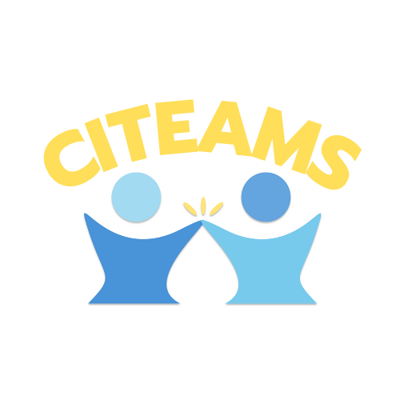

# MCIT On-Campus 2022 Winter Hackathon

## Project Name: CITeams

### Group Members

| Name | Email |
| :-------------: | :-----------------------------------------------------------: |
| Jiayun(Seren) Liu | jiayunl@seas.upenn.edu |
| Ruichen Zhang | ruichenz@seas.upenn.edu |
| Ruifan Wang | wang321@seas.upenn.edu |
| Wentao Xu | wentaoxu@seas.upenn.edu |
| Yihong(Joanne) Zhang | zhyihong@seas.upenn.edu |

### Project Description

CITeams is a convenient Slack App that helps MCIT students find course project team members and study mates. This Slack App makes the teammate matching process easier as MCIT students often face challenges of finding group members for course projects or simply study mates, especially during Covid-19 when students have to study remotely and do not have much interaction in person. In terms of some core features, a user can create, delete, and edit posts of recruitment for teammates or study mates. A user and the relevant users (current teammates) will be added to a channel created by the slack APP once the post is published. A user can see all public recruitment posts and choose to enter the channel that fits their need.
### Anticipated Tech Stack
1. NodeJS
2. Bolt for JavaScript (Slack API)
3. MongoDB Atlas (Database)
4. Heroku (NodeJS hosting)

### Prospect
Looking into the future, CITeams will try to satisfy more application scenarios such as matching mock interview partners and food/bar mates, etc.

### Development Instructions

1. Run `git clone git@github.com:Hackathon-CITeam/CITeams.git` to clone the project to your local machine.
2. `cd` into the repo you just created, run `git branch [your name]` to create your own branch.
3. Create a `.env` file and add tokens, secrets and database url to the file; open the `.gitignore` file, make sure `node_modules` and `.env` are ignored; in other words, **DO NOT** push them to GitHub.
4. run `npm install` to install dependencies **the first time** you created the project; run `node app.js` to start the app, and check the app in Slack. **Every time** you make code changes, you need to restart the app using `node app.js` and refresh the app using `command + R` to see the latest changes reflected in the Slack app. 
5. After you have made some code changes on your branch, run `git add .`, `git commit -m "your commit message"`, `git push` to commit your change to your remote branch on GitHub. Note that you need to run `git push --set-upstream origin [your branch name]` **the first time** after you created your local branch. Only push codes to GitHub if you make sure that the app is not broken after your latest code change.
6. Regularly push your code to GitHub, and make pull requests from main branch to fetch latest changes; talk to your other team members if you encounter a conflict and are not sure how to resolve it.

### Links

Use the prototypes in PRD as reference, implement the views using Block Kit Builder. 

1. [Hackathon Devpost Homepage](https://mcit-2022-winter-hackathon.devpost.com/)
2. [PRD Google Doc](https://docs.google.com/document/d/1QmjjsY4zd4bcX3Dy_w8sGSnYyfJp9Zwr6nN-WpP9Cso/edit)
3. [CITeams App Home](https://api.slack.com/apps/A02TYDHMNTG)
4. [Slack API Documentation](https://api.slack.com/start)
5. [Bolt for JavaScript & Glitch Template](https://api.slack.com/start/building/bolt-js)
6. [Socket Mode](https://slack.dev/node-slack-sdk/socket-mode)
7. [Block Kit Builder (View Templates)](https://app.slack.com/block-kit-builder/)
8. [Emoji Cheatsheet](https://www.webfx.com/tools/emoji-cheat-sheet/)
9. [MongoDB CRUD](https://docs.mongodb.com/manual/crud/)
10. [MongoDB Atlas](https://account.mongodb.com/account/login)
11. [Heroku](https://id.heroku.com/login)

Jan 14th
